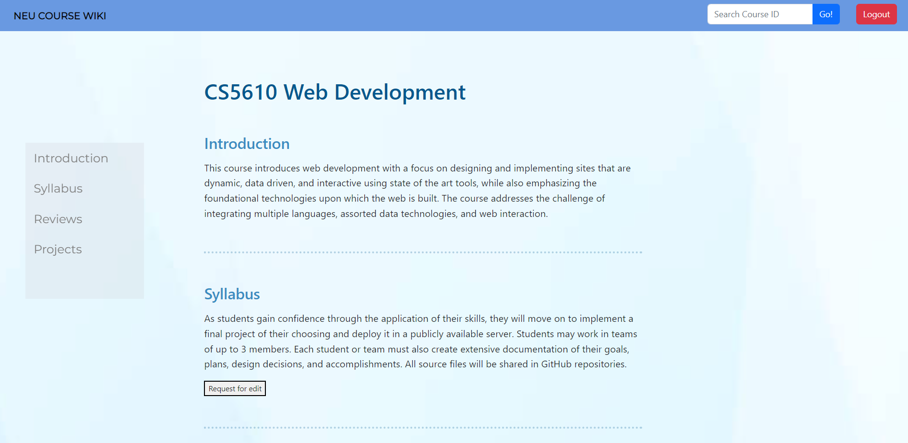
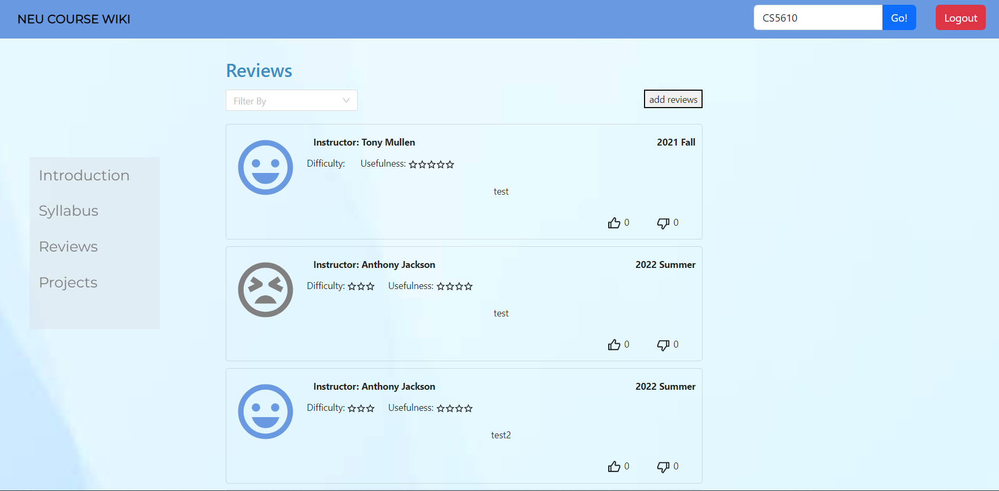
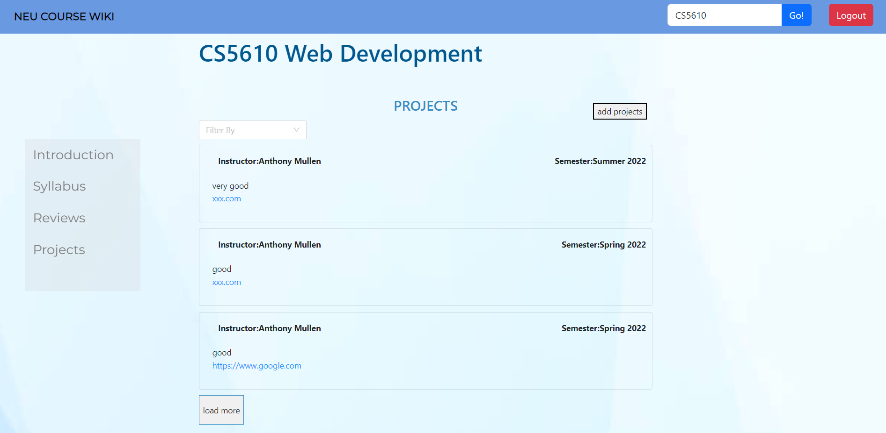

# NEU Course Wiki

Group project of NEU CS5610 Web Development

## Heroku Deploy  
https://coursewiki-frontend-darkhorse.herokuapp.com/

## Test Methods:  
Search Course ID in the search box on homepage or on top navigation bar.
Try: CS5610 or CS5200

## Introduction
The official introduction and reviews for courses are not quite referenceable when students are registering for courses. This project aims to allow students to write reviews and upload course guidelines and their course projects. This can help provide suggestions and inspiration for later students to choose courses and plan schedules. For now, the app only covers courses provided at NEU Seattle Campus. So students at the Seattle campus will benefit the most. The range can be expanded if needed.

 

## Functionality  
1. Search by course ID  
    -Links to the corresponding course page if course exists.  
    -Pop up a window to alert user that course not found.
2. Display course introduction, syllabus, reviews and projects  
    -Introduction is the same as the course introduction in official NEU course schedule. 
3. Request to upload syllabus for each course
4. Reviews:  
    -All users can see reviews while only logged in users can add reviews.   
    -When a not logged in user try to add a review, a notification pop up will remind them to login.   
    -All users can upvote and downvote a review.  
    -Users can filter reviews by semester and instructors: Semesters are written in the files.    
    -Use pagination component to see all reviews for a course.  
5. Projects:  
    -All users can see all projects.   
    -Users can filter projects by semester and instructors: Semesters are written in the files.    
    -All users can click the link to view the project.  
    -Load more button and back to the top button can help you view the projects.  

- Home Page:   
   

- Course Page: 
  
 

- Project Page:  
  

